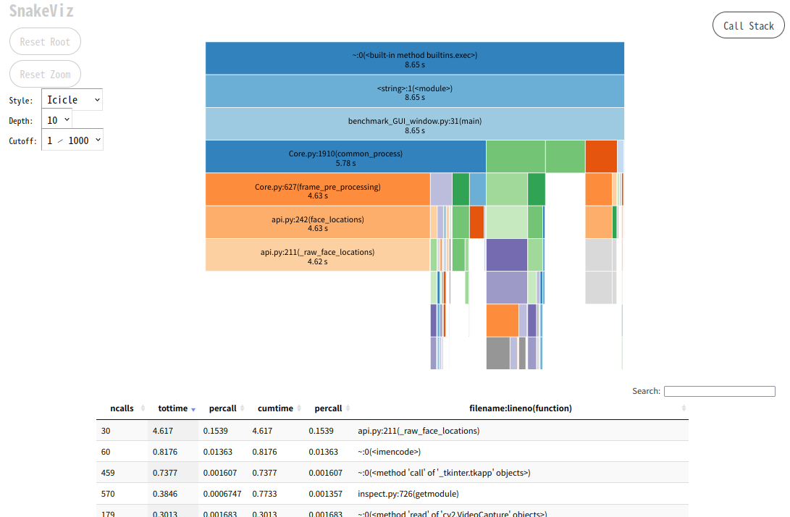
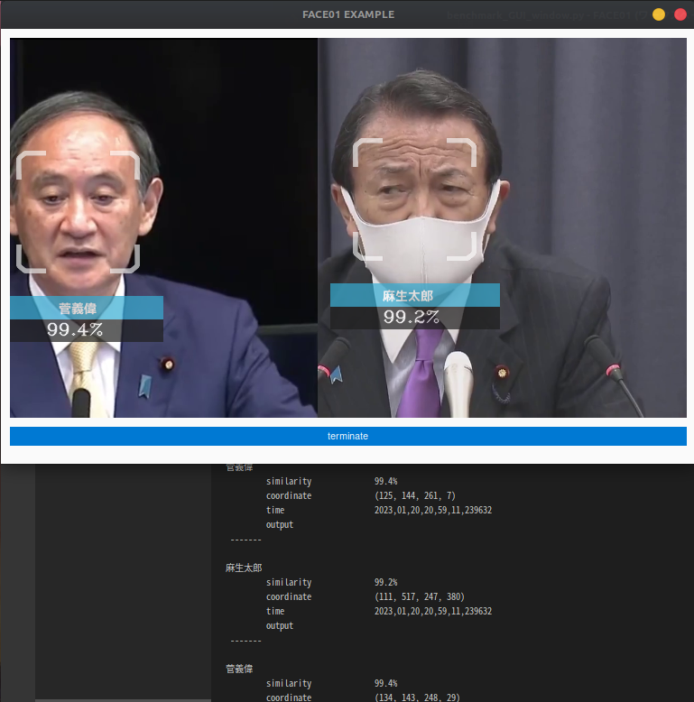
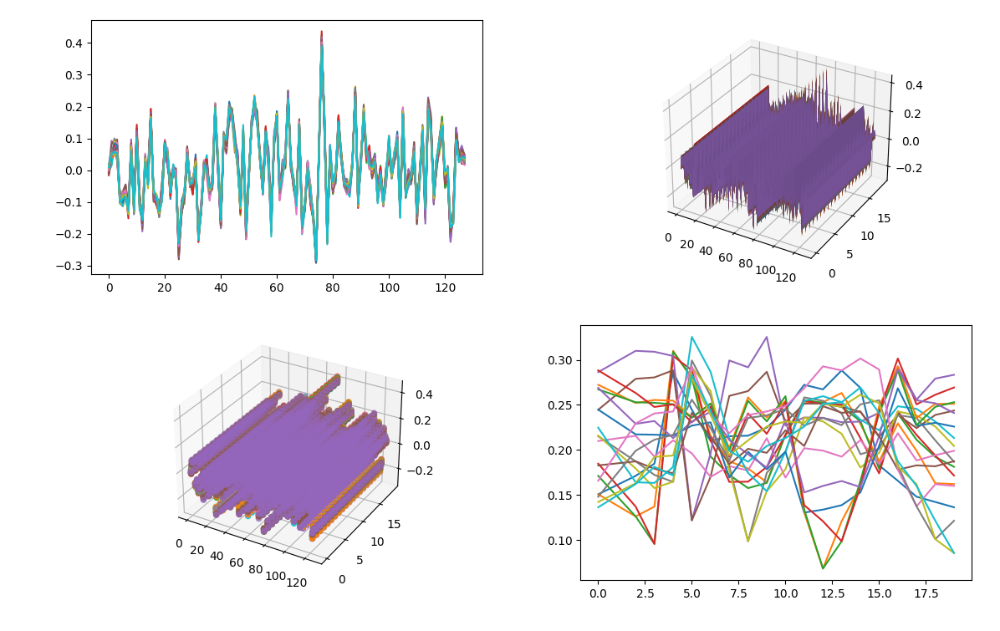
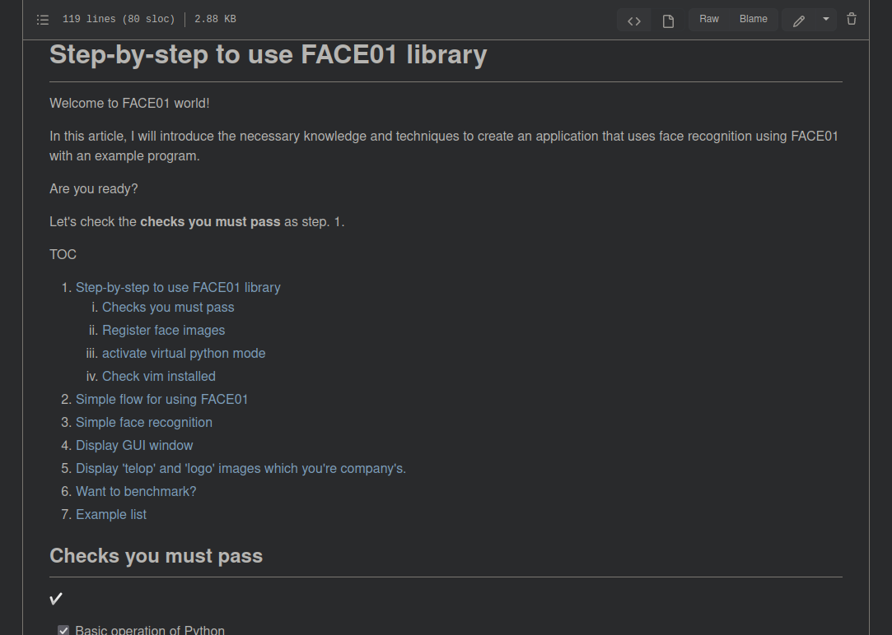
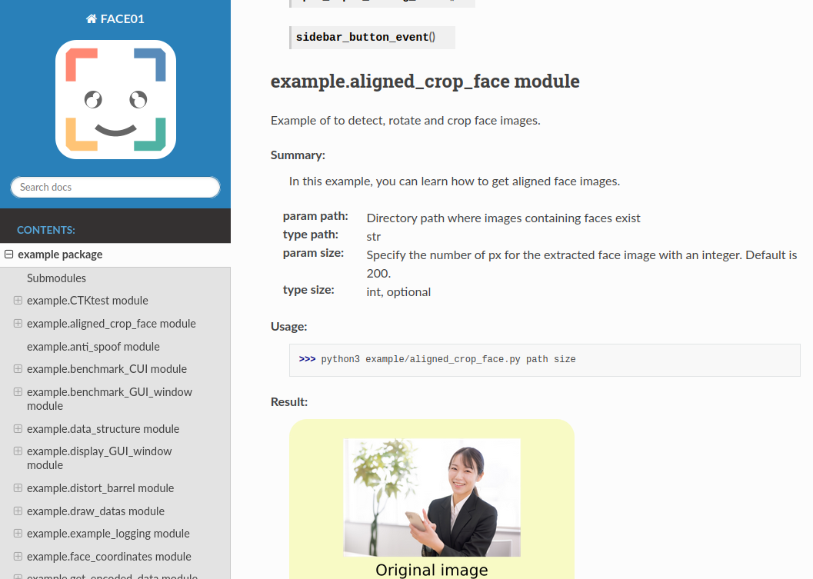

<div align="center">


⚡️ オープンソース

⚡️ 日本人の顔に最適化された顔学習モデル

⚡️ 多くの便利なメソッド

⚡️ 豊富で包括的なドキュメント

FACE01 -- さあ、始めましょう！

___


</div>

```bash
## result
Audrey Hepburn
         Anti spoof              real
         Anti spoof score        100.0 %
         similarity              99.1%
         coordinate              (123, 390, 334, 179)
         time                    2022,08,09,04,19,35,552949
         output                  output/Audrey Hepburn_2022,08,09,04,19,35,556237_0.39.png
 -------
 ```

---

📖 TOC
- [About FACE01](#about-face01)
- [ℹ️: Note](#ℹ️-note)
  - [リポジトリについて](#リポジトリについて)
  - [その他](#その他)
- [Install](#install)
  - [Dockerイメージを使用する](#dockerイメージを使用する)
  - [INSTALL\_FACE01.sh](#install_face01sh)
  - [モジュールのインストールについて](#モジュールのインストールについて)
  - [Pythonのパスを設定する](#pythonのパスを設定する)
- [Example](#example)
- [Document](#document)
- [設定ファイル: config.ini](#設定ファイル-configini)
- [Update](#update)
- [Acknowledgments](#acknowledgments)
- [References](#references)

---

## About FACE01

✨ `FACE01`は**日本人の顔に最適化された顔学習モデルJAPANESE FACEと、Pythonで書かれたオープンソースのリファレンス実装**です。

<br />
<div style="display: flex; align-items: center;">
    
    <div style="background-color: white; padding: 10px; border-radius: 10px; box-shadow: 2px 2px 5px rgba(0, 0, 0, 0.2); position: relative;">
        <p style="margin: 10;">日本人専用の高精度顔認識学習モデル「JAPANESE FACE V1」をトコトン便利に使うための<br />
        「⭐️豊富なクラスとメソッド⭐️」<br />
        が揃ってます！</p>
        <p style="margin: 10;">ドキュメントもめっちゃ充実してますよ💗</p>
        <div style="position: absolute; top: 50%; left: -15px; width: 0; height: 0; border-top: 10px solid transparent; border-bottom: 10px solid transparent; border-right: 15px solid white; transform: translateY(-50%);"></div>
    </div>
</div>
<br />


- 🎉 `v3.0.0`よりオープンソースとして公開いたしました。（`LICENSE`に従ってください）
- 🎉 [JAPANESE FACE V1](https://github.com/yKesamaru/FACE01_trained_models) が利用可能になりました！
  - `JAPANESE FACE V1` は日本人の顔認証に特化したモデルです。
- **10,000人以上**の顔データからリアルタイムで顔認証が可能です
- 超高速の顔座標出力機能
- 日付と時刻情報付きの顔画像保存機能
- 出力フレーム画像を修正する設定が可能
- 設定ファイルによる機能の集中管理
- RTSP、HTTP、USBなどの入力プロトコルを選択可能
- `顔認識` や `画像処理` のための多くの機能が利用可能です（詳細は[Useful FACE01 library](https://ykesamaru.github.io/FACE01_DEV/)をご覧ください）
- ...and many others!

---

## ℹ️: Note
### リポジトリについて
今後の開発は`FACE01_DEV`リポジトリ（このリポジトリ）で行われます。

`FACE01_SAMPLE`リポジトリは旧バージョンのため閉鎖されました。

`FACE01_DEV`リポジトリをご使用ください。


<br />
<div style="display: flex; align-items: center; justify-content: flex-end;">
    <div style="background-color: white; padding: 10px; border-radius: 10px; box-shadow: 2px 2px 5px rgba(0, 0, 0, 0.2); position: relative; margin-right: 10px;">
        <p style="margin: 10;">実稼働でなければ、企業様も自由に使用可能です！</p>
        <p style="margin: 10;">教育・研究用途でしたら著作権表示だけでOK！</p>
        <div style="position: absolute; top: 50%; right: -15px; width: 0; height: 0; border-top: 10px solid transparent; border-bottom: 10px solid transparent; border-left: 15px solid white; transform: translateY(-50%);"></div>
    </div>
    
</div>
<br />


### その他
- このリポジトリが提供するファイルは、無料でお使いいただけます。
教育機関でご利用の場合、ソースコードを研究・教育にご利用できます。
  詳しくは[日本のAI教育を支援する、顔認識ライブラリ`FACE01`の提供について](docs/academic.md)をご覧ください。
- 商用利用にあたっては別途ライセンスが必要です。（LICENSEファイルをご参照ください。）
- YouTubeにおけるJAPANESE FACE V1の使用ライセンスを追加しました。
  - VTuverにおける顔追従用のONNXモデルとして無料で使用できます。詳しくは[YouTube用ライセンス](docs/YouTube_license.md)をご参照ください。
- このリポジトリには`UBUNTU 22.04`用の`FACE01`モジュール、および`顔学習モデル`が含まれています。`Windows`ユーザーの方は、提供している`Docker`上でご利用ください。
- JAPANESE FACE（日本人に最適化された顔学習モデル）だけを使用したい場合は、[FACE01_trained_models](https://github.com/yKesamaru/FACE01_trained_models)リポジトリをご使用ください。

---

## Install

FACE01開発環境のセッティングは本当に簡単です！

### Dockerイメージを使用する

🐳 一番簡単で環境を汚さない方法は、`Docker`を使用することです。

[こちら](docs/docker.md)で丁寧な導入手順を解説をしていますのでぜひご覧ください。

docker未経験の方は[こちら](docs/Installation.md).

---

### INSTALL_FACE01.sh
実働環境を想定してまっさらなマシンに直接`FACE01`をインストールするには、`INSTALL_FACE01.sh`スクリプトを実行します。

```bash
wget https://raw.githubusercontent.com/yKesamaru/FACE01_DEV/master/INSTALL_FACE01.sh
chmod +x INSTALL_FACE01.sh
bash -c ./INSTALL_FACE01.sh
```

See [here](docs/Installation.md).

---

### モジュールのインストールについて
`INSTALL_FACE01.sh`にはモジュールのインストールコマンドが記述されています。
具体的には以下のコードです。
```bash
python3 -m venv ./
source bin/activate

pip cache remove dlib
pip install -U pip
pip install -U wheel
pip install -U setuptools
pip install .
```

しかしシステムを再起動した場合など、Python仮想環境から出てしまった場合、***再度`FACE01`を使用するには再びPython仮想環境をアクティベートしなくてはいけません。これは`Docker`を使用している場合も同様です。***
Python仮想環境をアクティベートするには以下のコマンドを実行してください。
```bash
. bin/activate
```

### Pythonのパスを設定する
システムによってはPythonのパスを毎回設定しなければならない場合もあります。（環境に依存します）
パスが通っていない場合は以下のコマンドを実行してください。
```bash
export PYTHONPATH=$PYTHONPATH:/path/to/your/project/FACE01_IOT_dev
```
`/path/to/your/project/`部分は個々の環境で修正してください。

---

## Example
`example`フォルダには、様々なスクリプト例が収録されています。
(全てのスクリプトが現在のバージョンに対応しているわけではないことに注意してください)

ステップ・バイ・ステップでEXAMPLEを試してみましょう！

See [here](docs/example_doc.md).

<div>




</div>

包括的なドキュメントは[こちら](https://ykesamaru.github.io/FACE01_DEV/)をご参照ください。

## Document

- 🧑‍💻 [Step-by-step to use FACE01 library](docs/example_doc.md#step-by-step-to-use-face01-library)
  - 初心者向け

    

- 🧑‍💻 [Comprehensive and detailed documentation](https://ykesamaru.github.io/FACE01_DEV/index.html)
  - 中級者以上向けの包括的なリソース

    

## 設定ファイル: config.ini

- 高い柔軟性を備えた使いやすい設定ファイル: config.ini
  See [here](docs/config_ini.md).


## Update

- 🔖 v3.0
  - オープンソースとして公開しました。
  - `LICENSE`を必ずご確認ください。
- 🔖 v2.2.02
  - `pyproject.toml`を追加。
  - `./example/*.py`について修正の追加。
- 🔖 v2.2.01
  - `EfficientNetV2 Arcface Model`を正式名称の`JAPANESE_FACE_V1`へ修正しました。
  - `Python 3.10.12`対応としました。他バージョンには対応していません。使用するシステムの`Python`バージョンが異なる場合は`Docker版`をお使いください。
  - `README`ほか、ドキュメントを日本語へ変更します。
  - 使用期限を延長しました。
  - `YouTube`で使用する際のライセンスを追加しました。
- 🔖 v2.1.05
  - Add `EfficientNetV2 Arcface Model`


---

## Acknowledgments
📄 I would like to acknowledgments those who have published such wonderful libraries and models.
1. [dlib](https://github.com/davisking/dlib) /  davisking
2. [face_recognition](https://github.com/ageitgey/face_recognition) /  ageitgey
3. [mediapipe](https://github.com/google/mediapipe) / google
4. [open_model_zoo](https://github.com/openvinotoolkit/open_model_zoo/tree/master/models/public/anti-spoof-mn3) /  openvinotoolkit
5. [light-weight-face-anti-spoofing](https://github.com/kprokofi/light-weight-face-anti-spoofing) /  kprokofi
6. [openvino2tensorflow](https://github.com/PINTO0309/openvino2tensorflow) / Katsuya Hyodo (PINTO0309)
7. [PINTO_model_zoo](https://github.com/PINTO0309/PINTO_model_zoo/tree/main/191_anti-spoof-mn3) / Katsuya Hyodo (PINTO0309)
8. [FaceDetection-Anti-Spoof-Demo](https://github.com/Kazuhito00/FaceDetection-Anti-Spoof-Demo) / KazuhitoTakahashi (Kazuhito00)
9. Some images from [Pakutaso](https://www.pakutaso.com/), [pixabay](https://pixabay.com/ja/)

## References

- [Deep Face Recognition A Survey](https://arxiv.org/pdf/1804.06655.pdf)
- [EfficientNetV2: Smaller Models and Faster Training](https://arxiv.org/pdf/2104.00298.pdf)
- [ArcFace: Additive Angular Margin Loss for Deep](https://arxiv.org/pdf/1801.07698.pdf)
- [MobileFaceNets: Efficient CNNs for Accurate Real-Time Face Verification on Mobile Devices](https://arxiv.org/ftp/arxiv/papers/1804/1804.07573.pdf)
- [Dlib Python API](http://dlib.net/python/index.html)
- [Pytorch documentation and Python API](https://pytorch.org/docs/stable/index.html)
- [ONNX documentation](https://onnx.ai/onnx/)
- [教育と著作権](http://www.ic.daito.ac.jp/~mizutani/literacy/copyright.pdf): 水谷正大 著, 大東文化大学 (2021)
- [日本人顔認識のための新たな学習モデル JAPANESE FACE v1](https://github.com/yKesamaru/FACE01_trained_models)