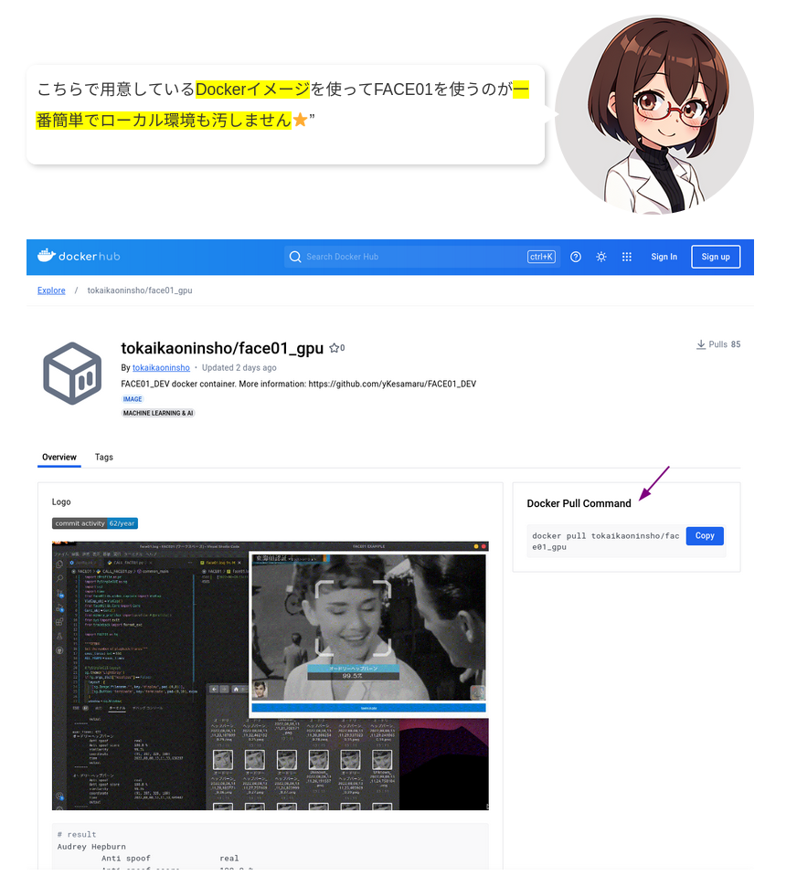

<div align="center">


✨ `FACE01`は**日本人の顔に最適化された顔学習モデルJAPANESE FACEと、<br />
Pythonで書かれたオープンソースのリファレンス実装**です。

⚡️ Apache License 2.0と商用ライセンスのデュアルライセンス！

⚡️ 日本人の顔に最適化された顔学習モデル⭐️''

⚡️ 豊富なクラスとメソッド！

⚡️ 包括的な[ドキュメント](https://ykesamaru.github.io/FACE01_DEV/index.html)付属！

FACE01 -- さあ、始めましょう！

___

<table style="border-collapse: collapse; border: 0;">
  <!-- ヘッダ -->
  <tr>
    <td style="border: 0;">Project Info</td>
    <td style="border: 0;">Docker Images</td>
    <td style="border: 0;">Document</td> <!-- Documentの後に</td>を閉じる -->
  </tr>
  <!-- ボディ -->
  <tr>
    <td style="border: 0;">
       
      <!-- GitHubのcommit-activityバッジ -->
      <br />
      
      <!-- リリースバッジ -->
      <br />
      =3.8-3776AB?logo=python&logoColor=FFD43B&labelColor=white&style=flat">
      <!-- Pythonバージョンバッジ -->
    </td>
    <td style="border: 0;">
      <a href="https://hub.docker.com/r/tokaikaoninsho/face01_no_gpu">
        
        <!-- Docker CPU版 pull数バッジ -->
      </a>
      <br />
      <a href="https://hub.docker.com/r/tokaikaoninsho/face01_gpu">
        
        <!-- Docker GPU版 pull数バッジ -->
      </a>
    </td>
    <td style="border: 0;">
      <a href="https://ykesamaru.github.io/FACE01_DEV/index.html">
        
        <!-- ドキュメントバッジ -->
      </a>
    </td>
  </tr>
</table>
<a href="https://hub.docker.com/r/tokaikaoninsho/face01_no_gpu">
        

<a href="https://hub.docker.com/r/tokaikaoninsho/face01_gpu">
        
        
<div>
  
  
  
  
  
</div>
<br />

---


</div>

```bash
## result
Audrey Hepburn
         Anti spoof              real
         Anti spoof score        100.0 %
         similarity              99.1%
         coordinate              (123, 390, 334, 179)
         time                    2022,08,09,04,19,35,552949
         output                  output/Audrey Hepburn_2022,08,09,04,19,35,556237_0.39.png
 -------
 ```

---

## FACE01とは
✨ `FACE01`は**日本人の顔に最適化された顔学習モデルJAPANESE FACEと、Pythonで書かれたオープンソースのリファレンス実装**です。

### なにが便利？
#### 優れポイント①
`FACE01`を使うと入力映像の1フレームごとに、「**いつ・誰が・どの座標で**」映っているかの情報を**1行で取得できます**！

```python
Core().common_process(CONFIG).__next__()
```
取得されるデータは以下のとおりです。
1. 映像のNDArrayデータ
2. 顔の座標（複数人可）
3. 名前（複数人可）
4. 日付時刻
5. 確度（%）

また顔画像を各フレームごとにディスクへ保存します。

#### 優れポイント②
##### 優れた顔学習モデル
日本人専用の顔学習モデル「JAPANESE FACE V1」が使えます！（後述）

#### 優れポイント③


- 🎉 LICENSEが「もっと使いやすく」なりました！実稼動以外はアパッチライセンスV2です！
- 🎉 `v3.0.0`よりオープンソースとして公開いたしました。（[LICENSE](https://github.com/yKesamaru/FACE01_DEV/blob/master/LICENSE/why_apache_license.md)に従ってください）
- 🎉 [エグザンプルコード集とドキュメント](https://ykesamaru.github.io/FACE01_DEV/example.html)が更に充実しました！（後述）
- 🎉 [JAPANESE FACE V1](https://github.com/yKesamaru/FACE01_trained_models) が利用可能になりました！
  - `JAPANESE FACE V1` は日本人の顔認証に特化したモデルです。
- **10,000人以上**の顔データからリアルタイムで顔認証が可能です
- 超高速の顔座標出力機能
- 日付と時刻情報付きの顔画像保存機能
- 出力フレーム画像を修正する設定が可能（モザイク・ロゴ挿入など）
- 設定ファイルによる機能の集中管理
- RTSP、HTTP、USBなどの入力プロトコルを選択可能
- `顔認識` や `画像処理` のための多くの機能が利用可能です（詳細は[Useful FACE01 library](https://ykesamaru.github.io/FACE01_DEV/)をご覧ください）
- ...and many others!


---

## なぜFACE01を開発したの？

顔認証システムはあらゆるシーンで使用されるのにも関わらず、AIのコアである学習モデルはほとんどが**アメリカか中国で開発**されています。

AIコアが外国産である場合、肝心なところで「**偽陽性**」、つまり誤判定が発生することがあります。この問題は発生頻度が少ないこともあり、再現性が取りづらく、その反面、発生した場合は重大なアクシデントとなり得ます。

<!-- <br />
<div style="display: flex; align-items: center;">
    
    <div style="background-color: white; padding: 10px; border-radius: 10px; box-shadow: 2px 2px 5px rgba(0, 0, 0, 0.2); position: relative;">
        <p style="margin: 10;">東アジアだけに絞っても<span style="background-color: yellow;">日本人、漢民族、満州族、回族、ウイグル人、チベット人、モンゴル人、チワン族、チャン族、ミャオ族、トゥチャ族、韓民族、カザフ人、ザイ族</span>が存在します⭐️''</p>
        <p style="margin: 10;">日本人以外の顔データで学習されたモデルを日本人だけに使うのは想定されてないはずです⭐️''</p>
        <div style="position: absolute; top: 50%; left: -15px; width: 0; height: 0; border-top: 10px solid transparent; border-bottom: 10px solid transparent; border-right: 15px solid white; transform: translateY(-50%);"></div>
    </div>
</div>
<br /> -->


このため**日本人だけの大規模顔顔データセット**から学習した「JAPANESE FACE V1」を開発し、顔認証アプリケーションに必要なクラスを揃えました。


---

## モデル性能

日本人の顔認証に特化した学習モデルは、一般的な顔認証システムが抱える問題(**若年日本人女性に対する偽陽性**)を解決しました。

たとえば、一般的な学習モデルの場合、以下に示すような若年日本人女性の判別が難しい場合があります。


<p align="center"><em>dlib学習モデルで偽陽性を出す例</em></p>

これに対し、新しく学習されたモデル「`JAPANESE FACE`」（下のグラフでは`JAPANESE_FACE_V1.onnx`））では、精度を落とすことなく判別できていることが示されました。


若年日本人女性の顔画像に対して、**DlibのAUCが0.94に対し、JAPANESE FACEは0.98を達成**しています⭐️''。

既存の顔認証モデルと比べて性能が向上してるのが分かりますね⭐️''。

くわしくは、「[Dlib顔学習モデルの、若年日本人女性データセットにおける性能評価](https://tokai-kaoninsho.com/%e3%82%b3%e3%83%a9%e3%83%a0/dlib%e9%a1%94%e5%ad%a6%e7%bf%92%e3%83%a2%e3%83%87%e3%83%ab%e3%81%ae%e3%80%81%e8%8b%a5%e5%b9%b4%e6%97%a5%e6%9c%ac%e4%ba%ba%e5%a5%b3%e6%80%a7%e3%83%87%e3%83%bc%e3%82%bf%e3%82%bb%e3%83%83%e3%83%88/) 」からご覧いただけます。

---


## インストール

FACE01開発環境のセッティングは本当に簡単です！

### Dockerイメージを使用する（推奨）

🐳 一番簡単で環境を汚さない方法は、`Docker`を使用することです。

[こちら](https://ykesamaru.github.io/FACE01_DEV/step_by_step/docker.html)で丁寧な導入手順を解説をしていますのでぜひご覧ください。



---

### 実働環境のPCにインストールする
実働環境を想定してまっさらなマシンに直接`FACE01`をインストールするには、`INSTALL_FACE01.sh`スクリプトを実行します。

```bash
wget https://raw.githubusercontent.com/yKesamaru/FACE01_DEV/master/INSTALL_FACE01.sh
chmod +x INSTALL_FACE01.sh
bash -c ./INSTALL_FACE01.sh
```

詳しくは[こちら](https://ykesamaru.github.io/FACE01_DEV/step_by_step/Installation.html)をご覧ください。

---

### Python仮想環境にインストールする
1. リポジトリをクローンします。
```bash
git clone https://github.com/yKesamaru/FACE01_DEV.git
cd FACE01_DEV
```
2. 仮想環境を作成し、パッケージをインストールします
```bash
$ python3 -m venv ./venv  # python3-venvがインストールされている前提
$ source venv/bin/activate
# 上記のように仮想環境構築後
$ pip install .
```
3. インストールが成功したことを確認します。
```bash
pip show FACE01
```
以下のように出力されたら成功です。
```bash
$ pip show FACE01
Name: FACE01
Version: 3.4.2
Summary: 顔認証学習モデルとユーティリティプログラム
Home-page: https://tokai-kaoninsho.com/
Author: 
Author-email: Yoshitsugu Kesamaru <y.kesamaru@tokai-kaoninsho.com>
License: 
Location: ~/FACE01_DEV/venv/lib/python3.10/site-packages
Requires: mediapipe, memory-profiler, mojimoji, nptyping, numpy, onnx, onnxruntime-gpu, opencv-python, Pillow, protobuf, psutil, pyqrcode, qrcode, requests, scipy, torch, torchvision, tqdm, typing_extensions, urllib3
Required-by: 
```
4. `dlib`を手動インストールする
```bash
# GPU用の設定 (dlibをソースからインストール)
tar -jxvf dlib-19.24.tar.bz2
cd dlib-19.24
python3 setup.py install --clean
```
#### 手動インストールの成否確認方法
もしビルド中に以下のような記述が出力されていたらGPUを利用できません。この場合はドキュメントを参考にしてGPUが使えるビルドができるようにしてください。
```bash
*****************************************************************************
 *** No BLAS library found so using dlib's built in BLAS.  However, if you ***
 *** install an optimized BLAS such as OpenBLAS or the Intel MKL your code ***
 *** will run faster.  On Ubuntu you can install OpenBLAS by executing:    ***
 ***    sudo apt-get install libopenblas-dev liblapack-dev                 ***
 *** Or you can easily install OpenBLAS from source by downloading the     ***
 *** source tar file from http://www.openblas.net, extracting it, and      ***
 *** running:                                                              ***
 ***    make; sudo make install                                            ***
 *****************************************************************************
CUDA_TOOLKIT_ROOT_DIR not found or specified
-- Could NOT find CUDA (missing: CUDA_TOOLKIT_ROOT_DIR) (found suitable version "11.5", minimum required is "7.5")
-- DID NOT FIND CUDA
-- Disabling CUDA support for dlib.  DLIB WILL NOT USE CUDA
-- C++11 activated.
-- Configuring done
-- Generating done
-- Build files have been written to: /home/terms/ドキュメント/test_face01/FACE01_DEV/dlib-19.24/build/temp.linux-x86_64-3.10
Invoking CMake build: 'cmake --build . --config Release -- -j8'
```

本来はビルド中に以下のように出力されます。
```bash
-- Found CUDA: /usr/local/cuda (found suitable version "12.3", minimum required is "7.5") 
-- Looking for cuDNN install...
-- Found cuDNN: /usr/lib/x86_64-linux-gnu/libcudnn.so
-- Building a CUDA test project to see if your compiler is compatible with CUDA...
-- Building a cuDNN test project to check if you have the right version of cuDNN installed...
-- Enabling CUDA support for dlib.  DLIB WILL USE CUDA, compute capabilities: 50
```

ビルドが終わったら次のようにして確認をしてください。
```bash
$ python
Python 3.10.12 (main, Nov  6 2024, 20:22:13) [GCC 11.4.0] on linux
Type "help", "copyright", "credits" or "license" for more information.
>>> import dlib
>>> dlib.DLIB_USE_CUDA
True
>>> 
```
`True`と表示されていれば成功です。

---

## すぐに試せるverifyコマンド
<style>
  figure {
    display: inline-block; /* 横並びにする */
    margin: 0 10px;        /* 画像間の余白を設定 */
    text-align: center;    /* キャプションを中央揃え */
  }
</style>

<div>
  <figure>
    
    <figcaption>c045.png</figcaption>
  </figure>
  <figure>
    
    <figcaption>c006.png</figcaption>
  </figure>
</div>

```bash
$ verify assets/data/c/c045.png assets/data/c/c006.png

2枚の画像は同一人物と判定しました。cos_sim=0.318
結果: True
```
ヘルプを参照する
```bash
$ verify -h
usage: verify [-h] [--threshold THRESHOLD] image1 image2

2枚の画像から同一人物かを判定します。

positional arguments:
  image1                1枚目の画像パス (png, jpg, jpeg)
  image2                2枚目の画像パス (png, jpg, jpeg)

options:
  -h, --help            show this help message and exit
  --threshold THRESHOLD
                        同一人物判定のコサイン類似度のしきい値 (0~1, default=0.25)
```

---

## 豊富なエグザンプルコード
`example`フォルダには、様々なスクリプト例が収録されています。
(全てのスクリプトが現在のバージョンに対応しているわけではないことに注意してください)

[ステップ・バイ・ステップ](https://ykesamaru.github.io/FACE01_DEV/step_by_step.html)でEXAMPLEを試してみましょう！

<div>


</div>

包括的なドキュメントは[こちら](https://ykesamaru.github.io/FACE01_DEV/)をご参照ください。

---

## ドキュメント
🧑‍💻 [丁寧で包括的なドキュメント](https://ykesamaru.github.io/FACE01_DEV/step_by_step.html)が付属します⭐️''

初心者にとっても優しい！！💗


全てのクラスとメソッドをまとめたリファレンスも！！

開発者にもとっても優しい💗


---

## Update

- 🔖 v3.04.2
  - 設定なしですぐ試せるverifyコマンドを追加しました。
- 🔖 v3.0
  - オープンソースとして公開しました。
    - `LICENSE`を必ずご確認ください。
  - 使用期限が廃止されました。（コメントアウトを外すことで機能は使えます）
- 🔖 v2.2.02
  - `pyproject.toml`を追加。
  - `./example/*.py`について修正の追加。
- 🔖 v2.2.01
  - `EfficientNetV2 Arcface Model`を正式名称の`JAPANESE_FACE_V1`へ修正しました。
  - `Python 3.10.12`対応としました。他バージョンには対応していません。使用するシステムの`Python`バージョンが異なる場合は`Docker版`をお使いください。
  - `README`ほか、ドキュメントを日本語へ変更します。
  - 使用期限を延長しました。
  - `YouTube`で使用する際のライセンスを追加しました。
- 🔖 v2.1.05
  - Add `EfficientNetV2 Arcface Model`

---

## ℹ️: Note
### リポジトリについて
今後の開発は`FACE01_DEV`リポジトリ（このリポジトリ）で行われます。

`FACE01_SAMPLE`リポジトリは旧バージョンのため閉鎖されました。

`FACE01_DEV`リポジトリをご使用ください。

### その他
- このリポジトリが提供するファイルは、無料でお使いいただけます。
教育機関でご利用の場合、ソースコードを研究・教育にご利用できます。
  詳しくは[日本のAI教育を支援する、顔認識ライブラリ`FACE01`の提供について](https://github.com/yKesamaru/FACE01_DEV/blob/master/LICENSE/why_apache_license.md)をご覧ください。
- 商用利用では実稼動のみライセンスが必要です。（[LICENSEファイル](https://github.com/yKesamaru/FACE01_DEV/blob/master/LICENSE/LICENSE)をご参照ください。）
- YouTubeにおけるJAPANESE FACE V1の使用ライセンスを追加しました。
  - VTuverにおける顔追従用のONNXモデルとして無料で使用できます。詳しくは[YouTube用ライセンス](https://github.com/yKesamaru/FACE01_DEV/blob/master/LICENSE/YouTube_license.md)をご参照ください。
- このリポジトリには`UBUNTU 22.04`用の`FACE01`モジュール、および`顔学習モデル`が含まれています。`Windows`ユーザーの方は、提供している`Docker`上でご利用ください。
- JAPANESE FACE（日本人に最適化された顔学習モデル）だけを使用したい場合は、[FACE01_trained_models](https://github.com/yKesamaru/FACE01_trained_models)リポジトリをご使用ください。

---

## Acknowledgments
📄 I would like to acknowledgments those who have published such wonderful libraries and models.
1. [dlib](https://github.com/davisking/dlib) /  davisking
2. [face_recognition](https://github.com/ageitgey/face_recognition) /  ageitgey
3. [mediapipe](https://github.com/google/mediapipe) / google
4. [open_model_zoo](https://github.com/openvinotoolkit/open_model_zoo/tree/master/models/public/anti-spoof-mn3) /  openvinotoolkit
5. [light-weight-face-anti-spoofing](https://github.com/kprokofi/light-weight-face-anti-spoofing) /  kprokofi
6. [openvino2tensorflow](https://github.com/PINTO0309/openvino2tensorflow) / Katsuya Hyodo (PINTO0309)
7. [PINTO_model_zoo](https://github.com/PINTO0309/PINTO_model_zoo/tree/main/191_anti-spoof-mn3) / Katsuya Hyodo (PINTO0309)
8. [FaceDetection-Anti-Spoof-Demo](https://github.com/Kazuhito00/FaceDetection-Anti-Spoof-Demo) / KazuhitoTakahashi (Kazuhito00)
9. Some images from [Pakutaso](https://www.pakutaso.com/), [pixabay](https://pixabay.com/ja/)

---

## References

- [Deep Face Recognition A Survey](https://arxiv.org/pdf/1804.06655.pdf)
- [EfficientNetV2: Smaller Models and Faster Training](https://arxiv.org/pdf/2104.00298.pdf)
- [ArcFace: Additive Angular Margin Loss for Deep](https://arxiv.org/pdf/1801.07698.pdf)
- [MobileFaceNets: Efficient CNNs for Accurate Real-Time Face Verification on Mobile Devices](https://arxiv.org/ftp/arxiv/papers/1804/1804.07573.pdf)
- [Dlib Python API](http://dlib.net/python/index.html)
- [Pytorch documentation and Python API](https://pytorch.org/docs/stable/index.html)
- [ONNX documentation](https://onnx.ai/onnx/)
- [教育と著作権](http://www.ic.daito.ac.jp/~mizutani/literacy/copyright.pdf): 水谷正大 著, 大東文化大学 (2021)
- [日本人顔認識のための新たな学習モデル JAPANESE FACE v1](https://github.com/yKesamaru/FACE01_trained_models)