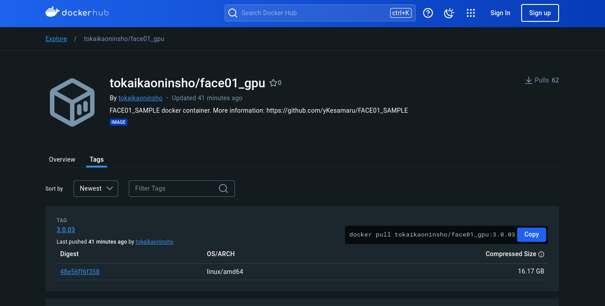

# To install Docker
See [here](Install_docker.md).


# Pull Docker image
\****The easiest way to use Docker is to pull the image.***\*



***NOTE***
> [!IMPORTANT]
> If you are using a PC with NVIDIA GPU installed, the Docker Image you should pull is `face01_gpu:3.3.03`.
> If not, the Docker Image you should pull is `face01_no_gpu:3.3.03`.


## When using `face01_gpu:3.3.03`
First, Check if GPU is available.
```bash
lspci | grep -i nvidia
```
Make sure nvidia-docker is installed.
```bash
docker run --gpus all --rm nvidia/cuda nvidia-smi
```
(To add NVIDIA GPU support to Docker, install the [NVIDIA Container Toolkit](https://github.com/NVIDIA/nvidia-docker/blob/master/README.md#quickstart). nvidia-container-runtime is only available on Linux.
See https://www.tensorflow.org/install/docker#gpu_support [ja])
  - Reference
    - NVIDIA Container Toolkit
      - [Overview](https://docs.nvidia.com/datacenter/cloud-native/container-toolkit/overview.html)
      - [User Guide](https://docs.nvidia.com/datacenter/cloud-native/container-toolkit/user-guide.html)


```bash
# Download Docker Image
docker pull tokaikaoninsho/face01_gpu:3.3.03

# Check `REPOSITORY`, `TAG`, and `IMAGE ID` of the downloaded Docker Image. (IMPORTANT!)
docker images

# Run Docker
docker run --rm -it \
  --gpus all -e DISPLAY=$DISPLAY \
  -v /tmp/.X11-unix/:/tmp/.X11-unix: tokaikaoninsho/face01_gpu:3.3.03
```


### **NOTE**
If you get an error as a result of entering the above command, try the following command.

```bash
docker run --rm -it \
  --gpus all -e DISPLAY=$DISPLAY \
  --device /dev/video0:/dev/video0:mwr \
  -v /tmp/.X11-unix/:/tmp/.X11-unix: tokaikaoninsho/face01_gpu:3.3.03
```

***Don't forget activate*** the Python virtual environment (activate venv).
```bash
# Activate venv (IMPORTANT!)
. bin/activate
```


Let's try `simple.py` in example folder.
```bash
python example/simple.py
```


## When using `face01_no_gpu:3.3.03`
```bash
# Download Docker Image
docker pull tokaikaoninsho/face01_no_gpu:3.3.03

# Check `REPOSITORY`, `TAG`, and `IMAGE ID` of the downloaded Docker Image. (IMPORTANT!)
docker images

# Run Docker
docker run --rm -it -v /tmp/.X11-unix/:/tmp/.X11-unix: tokaikaoninsho/face01_no_gpu:3.3.03
```


### **NOTE**
If you get an error as a result of entering the above command, try the following command.
```bash
docker run --rm -it \
  -e DISPLAY=$DISPLAY \
  --device /dev/video0:/dev/video0:mwr \
  -v /tmp/.X11-unix/:/tmp/.X11-unix: tokaikaoninsho/face01_no_gpu:3.3.03
```

***Don't forget activate*** the Python virtual environment (activate venv).
```bash
# Activate venv (IMPORTANT!)
. bin/activate
```


Let's try `simple.py` in example folder.
```bash
python example/simple.py
```


# Build Docker image
If you want to build the Docker Image yourself, See [here](build_docker_image.md).

