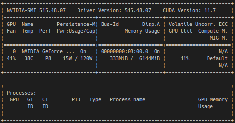

# Install Docker

Ubuntuにおいて、Dockerをインストールするにはいくつかの方法を選択できますが、インストールする前に`Docker Desktop`または`Docker Engine`のどちらを選ぶか決定する必要があります。公式チュートリアルは[こちら](https://docs.docker.com/engine/install/ubuntu/)にあります。
このセクションでは、`Docker Engine`および`Docker CE`のインストールについて説明します。

この情報を基に、適切なDockerのインストール方法を選んでください。

<!-- *If you're PC is not installed NVIDIA GPU card, refer [section]([docs/to_build_docker_image.md](Install_docker.md#if-youre-pc-is-not-installed-nvidia-gpu-card)) 'To build FACE01 docker image without nvidia-docker2 package'.* -->

<br />
<div style="display: flex; align-items: center; justify-content: flex-end;">
    <div style="background-color: white; padding: 10px; border-radius: 10px; box-shadow: 2px 2px 5px rgba(0, 0, 0, 0.2); position: relative; margin-right: 10px;">
        <p style="margin: 10;">こちらに掲載しているDockerのインストール方法は<span style="background-color: yellow;">情報が古くなる</span>可能性があります。</p>
        <p style="margin: 10;">必ず<span style="background-color: yellow;">公式サイト</span>をチェックしてください⭐️''</p>
        <div style="position: absolute; top: 50%; right: -15px; width: 0; height: 0; border-top: 10px solid transparent; border-bottom: 10px solid transparent; border-left: 15px solid white; transform: translateY(-50%);"></div>
    </div>
    
</div>
<br />

## NOTE
動作環境は以下のリストを満たしている必要があります。詳しくは[公式サイト](https://docs.nvidia.com/datacenter/cloud-native/container-toolkit/install-guide.html#platform-requirements)をご覧ください。
`GPU`を使用しない条件に於いてはこの限りではありません。

1. GNU/Linux x86_64 with kernel version > 3.10
2. Docker >= 19.03 (recommended, but some distributions may include older versions of Docker. The minimum supported version is 1.12)
3. NVIDIA GPU with Architecture >= Kepler (or compute capability 3.0)
4. NVIDIA Linux drivers >= 418.81.07 (Note that older driver releases or branches are unsupported.)

これらの条件は以下の操作で確認できます。
```bash
# カーネルヴァージョン
uname -r

# Your docker version.
docker --version

# GPUアーキテクチャ
lspci | grep -ie nvidia

# Your NVIDIA linux driver version.
nvidia-smi
```
GPUのアーキテクチャのリストは以下を参照して下さい。
- [Category:Nvidia_microarchitectures](https://en.wikipedia.org/wiki/Category:Nvidia_microarchitectures)
- [Nvidia_graphics_processing_units](https://en.wikipedia.org/wiki/List_of_Nvidia_graphics_processing_units)
- [sm-architectures-arch-and-gencode-for-various-nvidia-cards](https://arnon.dk/matching-sm-architectures-arch-and-gencode-for-various-nvidia-cards/)

## 便利なスクリプトを使いましょう
`Docker`のインストールは以下のスクリプトで行えます。
```bash
sudo apt update && sudo apt upgrade -y \
  && curl https://get.docker.com | sh \
  && sudo systemctl --now enable docker
```

## マニュアルインストール
また、以下のように手動で`Docker`をインストールもできます。
これらは予告なく更新されますので、正確な情報は`Docker`の公式サイトをご覧ください。
```bash
# Uninstall old versions
sudo apt remove docker docker-engine docker.io containerd runc
sudo apt update && sudo apt upgrade -y
# Set up the repository
sudo apt install \
    ca-certificates \
    curl \
    gnupg \
    lsb-release
# Add Docker’s official GPG key:
sudo mkdir -p /etc/apt/keyrings
curl -fsSL https://download.docker.com/linux/ubuntu/gpg | sudo gpg --dearmor -o /etc/apt/keyrings/docker.gpg
# Use the following command to set up the repository:
echo \
  "deb [arch=$(dpkg --print-architecture) signed-by=/etc/apt/keyrings/docker.gpg] https://download.docker.com/linux/ubuntu \
  $(lsb_release -cs) stable" | sudo tee /etc/apt/sources.list.d/docker.list > /dev/null
# NOTE: If you get an error about apt/sources.list, you should comment out docker's line at sources.list.
# Install Docker Engine
sudo apt install docker-ce docker-ce-cli containerd.io docker-compose-plugin
# NOTE: If you receive a GPG error when running apt update, run the following command and then try to update your repo again.
# sudo chmod a+r /etc/apt/keyrings/docker.gpg
# See bellow
# https://docs.docker.com/engine/install/ubuntu/#install-using-the-repository
sudo apt update
sudo apt install docker-ce docker-ce-cli containerd.io docker-compose-plugin
```
If you want to confirm installed Docker, try the following command.
`sudo docker run hello-world`

## `nvidia-docker2`をインストールする
`FACE01`を`Docker`で利用するには`nvidia-docker2`が必要です。
`nvidia-docker2`をインストールするには、[NVIDIA official tutorial](https://docs.nvidia.com/datacenter/cloud-native/container-toolkit/install-guide.html#setting-up-nvidia-container-toolkit)をご参照ください。

<br />
<div style="display: flex; align-items: center;">
    
    <div style="background-color: white; padding: 10px; border-radius: 10px; box-shadow: 2px 2px 5px rgba(0, 0, 0, 0.2); position: relative;">
        <p style="margin: 10;"><span style="background-color: yellow;">nvidia-docker2</span>をかならずインストールしましょう。</p>
        <div style="position: absolute; top: 50%; left: -15px; width: 0; height: 0; border-top: 10px solid transparent; border-bottom: 10px solid transparent; border-right: 15px solid white; transform: translateY(-50%);"></div>
    </div>
</div>
<br />

```bash
distribution=$(. /etc/os-release;echo $ID$VERSION_ID) \
      && curl -fsSL https://nvidia.github.io/libnvidia-container/gpgkey | sudo gpg --dearmor -o /usr/share/keyrings/nvidia-container-toolkit-keyring.gpg \
      && curl -s -L https://nvidia.github.io/libnvidia-container/$distribution/libnvidia-container.list | \
            sed 's#deb https://#deb [signed-by=/usr/share/keyrings/nvidia-container-toolkit-keyring.gpg] https://#g' | \
            sudo tee /etc/apt/sources.list.d/nvidia-container-toolkit.list

sudo apt update
sudo apt install -y nvidia-docker2
sudo systemctl restart docker
```

テストに関しては以下をご参照ください。

```bash
sudo docker run --rm --gpus all nvidia/cuda:11.0.3-base-ubuntu20.04 nvidia-smi
```


## インストールが終わったら
If you don’t want to preface the docker command with sudo, create a Unix group called docker and add users to it.
```bash
sudo groupadd docker
sudo usermod -aG docker $USER
```
See [here](https://docs.docker.com/engine/install/linux-postinstall/)

## When you want to delete all at once
See [`docker image prune`](https://docs.docker.com/config/pruning/).
Japanese is [here](https://docs.docker.jp/config/pruning.html).
Also, you chose some manner as bellow.
### Stop all containers
`docker stop $(docker ps -q)`
### Delete all containers
`docker rm $(docker ps -q -a)`
### Delete all images
`docker rmi $(docker images -q)`
### Delete all except specific images
`docker images -aq | grep -v 98c2341c70ce | xargs docker rmi`

## If you're PC is not installed NVIDIA GPU card
The Dockerfile you build must be `Dockerfile_no_gpu`.
The settings in config.ini are limited to bellow.
- `headless = True`
- `use_pipe = True`

See 'To build FACE01 docker image without nvidia-docker2 package' section described [here](./docker.md)