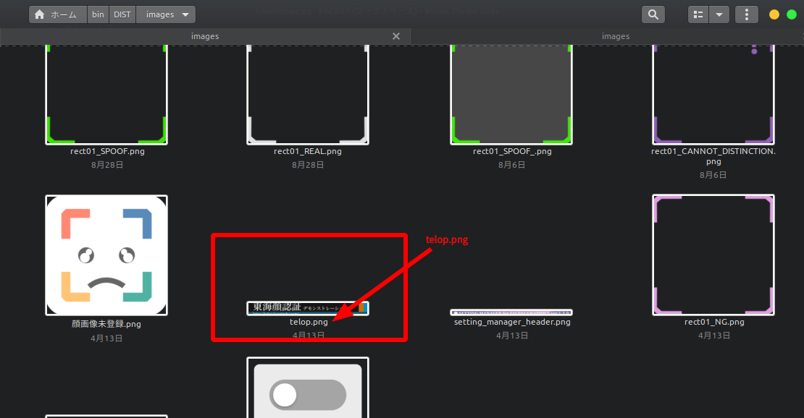

# テロップやロゴを会社のものへ変更する.
以下に説明するステップで行いましょう.

## 1. リプレースするテロップやロゴを用意してください.
ここでは練習用のテロップとロゴを用意しました。

   

## 2. テロップとロゴの画像ファイルを`images`ディレクトリに配置してください

   
   

## 3. 'telop.png'と'Logo.png'に置き換えます

   

## 4. イメージ画像をリプレースしてからアプリケーションを動作させると、それらがウィンドウ内に描画されます。

   

## 例に出した画像ファイルのライセンス

<a href="https://commons.wikimedia.org/wiki/File:SPARCO_COMPANY_LOGO.png">Sparco S.p.A</a>, <a href="https://creativecommons.org/licenses/by-sa/4.0">CC BY-SA 4.0</a>, via Wikimedia Commons

<a href="https://commons.wikimedia.org/wiki/File:COLLAR_Company_logo.jpg">Daria COLLAR</a>, <a href="https://creativecommons.org/licenses/by-sa/4.0">CC BY-SA 4.0</a>, via Wikimedia Commons