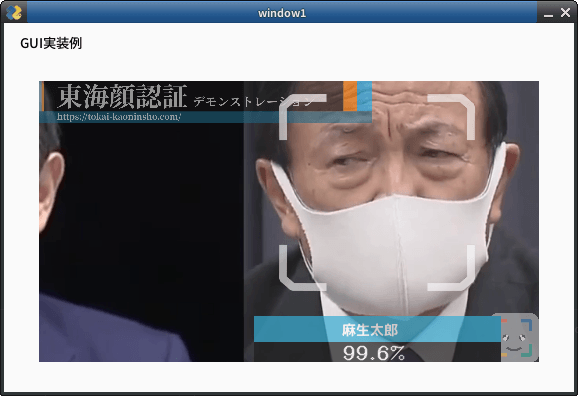

# `config.ini`ファイルについて

## `config.iniファイルとは
`FACE01`の設定ファイルです。Pythonの`ConfigParser`モジュールを使って、`FACE01`の様々な設定を管理します。

**[DEFAULT]セクション**は、標準的な初期設定値を定義するセクションです。このセクションの設定はあくまで例であり、必要に応じて変更できます。

## 注意（重要！）
`config.ini`ファイルを編集する前に、`ConfigParser`モジュールについて理解しておく必要があります。
`ConfigParser`モジュールに関する詳細な情報は、以下のリンクを参照してください。
https://docs.python.org/3/library/configparser.html

## 継承
各セクションは、**[DEFAULT]セクション**の設定を継承します。
そのため、各セクションでは、**[DEFAULT]セクション**の設定を上書きしたい項目（キーと値）のみを記述すればよいです。

## 書式
設定項目の記述形式は、`key=value`です。

## 編集方法
`Docker`イメージを使用している場合は、`vim`エディタを使って`config.ini`ファイルを直接編集できます。
```bash
# Example
$ vim ./config.ini
```

## ℹ️: Note
### `npKnown.npz`について
`npKnown.npz`がフォルダーに存在するとき、そのファイルが従来のdlibモデル(`dlib_face_recognition_resnet_model_v1.dat`)で作成されたものなのか、新しいモデル(`efficientnetv2_arcface.onnx`)で作成されたものなのかは重要な要素です。
  もし`config.ini`で指定した学習モデルと`npKnown.npz`が作られた学習モデルが一致しない場合、エラーが発生します。
  その場合は`npKnown.npz`を手動で削除してください。新しい`npKnown.npz`が自動的に作成されます。

### デバッグログの異常出力について
`mediapipe`を使用する時(`use_pipe = True`)、大量にデバッグログが標準出力される場合があります。繰り返し出力されるデバッグログには以下のようなものがあります。
  ```bash
  I0000 00:00:1723362224.558539   40707 gl_context_egl.cc:85] Successfully initialized EGL. Major : 1 Minor: 5
  I0000 00:00:1723362224.680348   40865 gl_context.cc:357] GL version: 3.2 (OpenGL ES 3.2 NVIDIA 555.42.06), renderer: NVIDIA GeForce GTX 1660 Ti/PCIe/SSE2
  W0000 00:00:1723362224.681858   40860 inference_feedback_manager.cc:114] Feedback manager requires a model with a single signature inference. Disabling support for feedback tensors.
  ```
  この現象は`mediapipe`が最新バージョンである場合でも起こりえます。また、このデバッグログを抑制する効果的な方法は見つかっていません。
  もしこの現象が現れる場合、`use_pipe = False`を検討してください。

### 補足
  環境によっては以下の対策でデバッグログを抑制する可能性があります。
  - `.bashrc`に以下を記述し、`source`コマンドで`.bashrc`をリロードする。
    ```bash
    # mediapipeのデバッグログを抑制する
    export MEDIPIPE_TRACE=0
    export GLOG_logtostderr=0
    ```
    ```bash
    # ~/.bashrcのリロード
    $ . .bashrc
    ```
  この現象は`FACE01_DEV/lib/python3.10/site-packages/mediapipe/python/_framework_bindings.cpython-310-x86_64-linux-gnu.so`が原因です。
  ```bash
  user@user:~/bin/FACE01_DEV/lib/python3.10/site-packages$ grep -r "Successfully initialized EGL" ./*
  grep: ./mediapipe/python/_framework_bindings.cpython-310-x86_64-linux-gnu.so: binary file matches
  user@user:~/bin/FACE01_DEV/lib/python3.10/site-packages$ grep -r "inference_feedback_manager" ./*
  grep: ./mediapipe/python/_framework_bindings.cpython-310-x86_64-linux-gnu.so: binary file matches
  ```
  `mediapipe`をソースコードからビルドする必要があるかも知れません。（未検証）

## Example and explain each items.

### [DEFAULT]

[DEFAULT] section is for simple example.
This [DEFAULT] setting for only use CUI mode.

Also, this setting is for user who's PC is \***not**\* installed Nvidia GPU card or IOT devices.

[DEFAULT] section is the inheritor of all sections.

### Items

- headless
  - `headless` means 'works CUI mode'. If you want to display GUI window, turn on value to False but process speed get slowly.
  - Type: bool
  - Default: True


- deep+learning_model
  - 従来のdlibモデル(`dlib_face_recognition_resnet_model_v1.dat`)と日本人の顔認証に特化したモデル(`efficientnetv2_arcface.onnx`)を切り替えることが出来ます。
    - int: 0 or 1
      - `dlib_face_recognition_resnet_model_v1.dat`: 0
      - `efficientnetv2_arcface.onnx`: 1
  - **NOTE**
    - 各モデルが生成する`npKnown.npz`は互いに互換性がありません。よって、`deep_learning_model`を変更した場合、既に作成されている`npKnown.npz`は手動で削除する必要があります。モデル切り替え後の`npKnown.npz`は新たに自動的に作成されます。

- anti_spoof
  - **Experimental**
  - Anti-spoof model is included with this sample, but please do ***not*** use this model as is for commercial use. Please contact tokai-kaoninsho for details.
  - Type: bool
  - Default: False


- output_debug_log = False
  - When True, will output debug log.
  - Type: bool
  - Default: False


- log_level
  - If you want to output debug log and message, modify this value to `debug`.
  - Type: str
  - Default: info


- set_width
  - Specify width of GUI window.
  - Type: int
  - Default: 750


- similar_percentage
  - Number of % which determine if the person on the screen is the person in the registered face information.
  - Type: float
  - Default: 99.1


- jitters
  - Number of value what means calculate jitters on running FACE01.
  - Type: int
  - Default: 0


- priset_face_images_jitters
  - Number of value what means calculate jitters for priset_face_images.
  - Type: int
  - Default: 100


- upsampling
  - Specifying the detected face area. ex. 0: 80x80px, 1: 40x40px
  - Type: int
  - Default: 0


- mode
  - `cnn` mode is use model what made from AI model. If you don't use CUDA, set `hog`.
  - Type: Type: str
  - Default: hog


- frame_skip
  - Specify the number to `drop frame`. Do not make it less than 2 *if use HLS*.
  - Type: int
  - Default: 5


- number_of_people
  - Do not 'analyze' (Encode and Recognize Process) more than the specified number of people.
  - Type: int
  - Default: 10


- use_pipe
  - Use mediapipe for face detection (coordinate calculation) instead of dlib face detection model.
  - Type: bool
  - Default: True


- model_selection
  - 0 OR 1
    - 0: Within 2 meters from the camera,
    - 1: Within 5 meters.
  - NOTE: This value is set only when `use_pipe` is `True`.
  - Type: int
  - Default: 1


- min_detection_confidence
- The minimum confidence value from the face detection model for the detection to be considered successful. If wearing the mask, set it to about 0.3. The lower the number, the higher the possibility of erroneous recognition other than the face. The standard is 0.4 to 0.5.
  - NOTE: You can set `person_frame_face_encoding` to `True` only if `use_pipe` is True.
  - Type: float
  - Default: 0.4


- person_frame_face_encoding
  - You can set person_frame_face_encoding to True only if `use_pipe` is `True`.
  - Type: bool
  - Default: False


- same_time_recognize
  - Number of people to recognize at the same time. Default is 2. Valid only if `use_pipe` is `True`.
  - Type: int
  - Default: 2


- set_area
  - Zoom.
     You can select from `NONE`, `TOP_LEFT`, `TOP_RIGHT`, `BOTTOM_LEFT`, `BOTTOM_RIGHT`, `CENTER`.
  - Type: Type: str
  - Default: NONE
  set_area = 'NONE'
  
  set_area = 'CENTER'
  
  set_area = 'TOP_LEFT'
  

- movie
  - For test, you can select from bellow.
    - usb (or USB)
      - USB Cam
    - assets/test.mp4 (Only a person.)
    - assets/顔無し区間を含んだテスト動画.mp4
      - Movie file which contain no person frames.
    - rtsp://wowzaec2demo.Type: Type: streamlock.net/vod/mp4:BigBuckBunny_115k.mp4
      - RTSP Type: Type: stream for test.
    - http://219.102.239.58/cgi-bin/camera?resolution=750
      - Live Type: Type: stream using HTTP for test: Live cam at Tokyo.
  - Type: Type: str
  - Default: assets/test.mp4


- user
  - User ID for RTSP.
  - Type: str
  - Default: None

- passwd
  - User password for RTSP.
  - Type: str
  - Default: None


- rectangle
  - Display a legacy face frame on the screen.
  - Type: bool
  - Default: False
  


- target_rectangle
  - Display a modern face frame on the screen
  - NOTE: You can select only one of `rectangle` or `target_rectangle`.
  - Type: bool
  - Default: False
  


- draw_telop_and_logo
  - Display of telop and log
  - Type: bool
  - Default: False


- default_face_image_draw
  - Display the registered face image on the scree
  - Type: bool
  - Default: False


- show_overlay
  - Make the information display on the screen semi-transparent
  - Type: bool
  - Default: False


- alpha
  - Adjust the translucency of 'overlay
  - Type: float
  - Default: 0.3


- show_percentage
  - Draw similarity in window.
  - Type: bool
  - Default: False


- show_name
  - Draw name in window.
  - Type: bool
  - Default: False


- crop_face_image
  - Save face image.
  - Type: bool
  - Default: True


- frequency_crop_image
  - Save face images per frame to storage.
  - Type: int
  - Default: 5


- crop_with_multithreading
  - Save face images using multi-threading. If using slower storage, set 'True'.
  - Type: bool
  - Default: False


- Python_version
  - Type: Type: str
  - Default: 3.8.1


- cpu_freq
  - Type: float
  - Default: 2.5


- cpu_count
  - Type: int
  - Default:


- memory
  - Type: int
  - Default: 4
  - GByt


- gpu_check
  - Type: bool
  - Default: True


- calculate_time
  - Type: bool
  - Default: True
  - time measurement


- show_video
  - Type: bool
  - Default: False


- number_of_crops
  - Type: int
  - Default: 0
  - Do *not* override.

