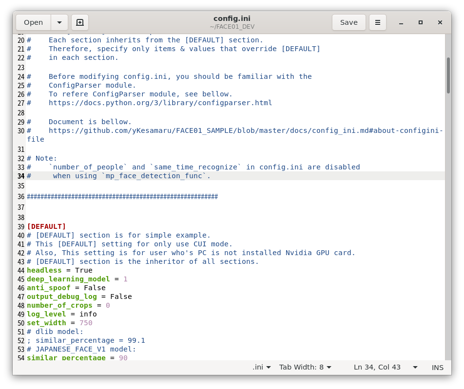
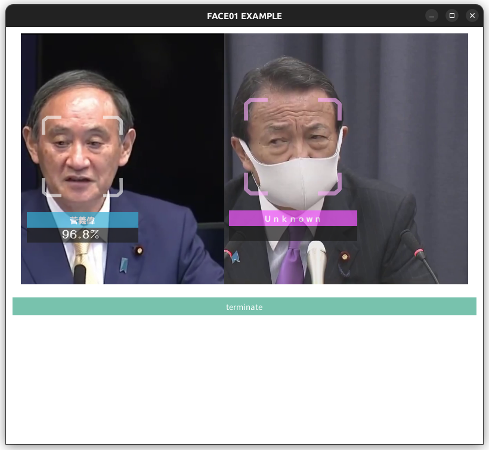

# `Docker`を使って`FACE01`を使う
ここでは`Docker`を使って煩雑な環境構築なしに`FACE01`を使用する手順を解説します。


## `Docker image`をプル
`Dockerイメージ`をダウンロード（プル）しましょう。


```bash
docker pull tokaikaoninsho/face01_gpu
```

> ![NOTE]:
> 使用するPCがNVIDIA GPUを使用しているなら、`face01_gpu`のような名前のついた`Docker image`を使用してください。
> そうでなければ、`face01_no_gpu`のような名前のついた`Docker image`を使用してください。

## When using `face01_gpu`
まずお使いのPCで`Nvidia GPU`が使用可能かチェックしましょう。
```bash
lspci | grep -i nvidia
```


### Docker Imageをダウンロードする
`docker pull tokaikaoninsho/face01_gpu`

### DockerイメージのTAG, IMAGE IDを確認しましょう
`docker images`

### DockerでGUIが使えるようにxhostの設定をします
`xhost +local:`
よくわからない場合は[DockerでGUIアプリケーションを開く基本的な押さえどころ](https://zenn.dev/ykesamaru/articles/add7d844f56516)を参考にしてください。

### ディスプレイマネージャとして`wayland`を使用している場合
ご用意している`docker イメージ`は`X11`環境で作成しております。ですのでお使いのディスプレイマネージャが`X11`あるいは`XWayland`であれば使用できますが、`Wayland`には対応していません。この場合はご自身でイメージをビルドしていただく必要があります。[build_docker_image.md](build_docker_image.md)をご参照ください。

### `image id`を指定してコンテナを起動します
```bash
docker run --rm -it \
    --gpus all -e DISPLAY=$DISPLAY \
    -v /tmp/.X11-unix:/tmp/.X11-unix \
    <image id>
```
開発用としてコンテナを起動させたい場合には、`--rm`を除去し、永続化のためのフォルダを指定してください。
例えば以下のようにします。（必要に応じて細部を変更してください。）
```bash
docker run -it \
    --gpus all -e DISPLAY=$DISPLAY \
    -v /tmp/.X11-unix:/tmp/.X11-unix \
    -v /path/to/host/folder:/path/to/container/folder \
    <image id>
```
ここで、'/path/to/host/folder'はホスト側の永続化したいデータを保存するフォルダパスを指定し、'/path/to/container/folder'はコンテナ内でそのデータを利用するためのフォルダパスを指定します。

例えば、ホストの'/home/user/dataフォルダ'をコンテナ内の'/mnt/data'にマウントしたい場合は、以下のようになります。
```bash
docker run -it \
    --gpus all -e DISPLAY=$DISPLAY \
    -v /tmp/.X11-unix:/tmp/.X11-unix \
    -v /home/user/data:/mnt/data \
    <image id>
```

#### **NOTE**
Webカメラなどを接続して使用する場合、以下のコマンドを実行してください。
この場合`/dev/video0`を指定していますが、ご利用の環境によってはパスがちがう可能性があります。
```bash
docker run --rm -it \
  --gpus all -e DISPLAY=$DISPLAY \
  --device /dev/video0:/dev/video0:mwr \
  -v /tmp/.X11-unix/:/tmp/.X11-unix: <image id>
```
もしデバイスパスがちがう場合は以下を試してください。
```bash
ls /dev/video*
```

## **絶対に忘れてはいけないポイント**
### Python仮想環境をアクティベート
Python仮想環境を起動してください。
```bash
# Activate venv (IMPORTANT!)
. bin/activate
```
例：
```bash
# Docker imageを確認する
user@user:~/bin/FACE01_DEV/assets$ docker images
REPOSITORY                     TAG        IMAGE ID       CREATED      SIZE
tokaikaoninsho/face01_no_gpu   3.0.03_3   87c09dec0a45   4 days ago   13.4GB
tokaikaoninsho/face01_gpu      3.0.03_3   ce2952ad62d6   4 days ago   22.3GB
tokaikaoninsho/face01_no_gpu   3.0.03_2   6f03f200582d   5 days ago   13.2GB
tokaikaoninsho/face01_gpu      3.0.03_2   c4203ae49bec   6 days ago   22.1GB
face01_gpu                     3.0.03_1   abd4c0896c00   7 days ago   21.9GB
tokaikaoninsho/face01_gpu      3.0.03_1   abd4c0896c00   7 days ago   21.9GB

# xhostにlocalを加える
user@user:~/bin/FACE01_DEV/assets$ xhost +local:
non-network local connections being added to access control list
# localが加わっているか確認
user@user:~/bin/FACE01_DEV/assets$ xhost
access control enabled, only authorized clients can connect
LOCAL:
SI:localuser:user

# コンテナをGUIモードで起動
user@user:~/bin/FACE01_DEV/assets$ docker run --rm -it \
    --gpus all -e DISPLAY=$DISPLAY \
    -v /tmp/.X11-unix:/tmp/.X11-unix ce2952ad62d6

==========
== CUDA ==
==========

CUDA Version 11.6.1

Container image Copyright (c) 2016-2023, NVIDIA CORPORATION & AFFILIATES. All rights reserved.

This container image and its contents are governed by the NVIDIA Deep Learning Container License.
By pulling and using the container, you accept the user and conditions of this license:
https://developer.nvidia.com/ngc/nvidia-deep-learning-container-license

A copy of this license is made available in this container at /NGC-DL-CONTAINER-LICENSE for your convenience.

*************************
** DEPRECATION NOTICE! **
*************************
THIS IMAGE IS DEPRECATED and is scheduled for DELETION.
    https://gitlab.com/nvidia/container-images/cuda/blob/master/doc/support-policy.md

# Python仮想環境をアクティベートする
docker@bb030de27861:~/FACE01_DEV$ . bin/activate

# 試しにエグザンプルコードを使ってみる
(FACE01_DEV) docker@bb030de27861:~/FACE01_DEV$ python example/simple.py

# config.iniファイルをgeditで開き、編集する
(FACE01_DEV) docker@bb030de27861:~/FACE01_DEV$ gedit config.ini

# GUIウィンドウを作成するエグザンプルコードを使ってみる
(FACE01_DEV) docker@bb030de27861:~/FACE01_DEV$ python example/display_GUI_window.py
```



### `xhost`
使い終わったら`xhost`から`local`を削除しましょう
`xhost -local:`

## トラブルシューティング
### Dockerコンテナを機動したがエグザンプルコードが動かない
- プルしたイメージが最新か確認してください
- Python仮想環境を起動したか確認してください
- `xhost`の`local`を追加したか確認してください
### エグザンプルコードは起動したが処理がおそすぎる
- Nvidia GPUを搭載したPCかどうかを確認してください
- コンテナとホストのCUDAドライバを確認してください
  - ホストのCUDAドライバのバージョンによってはコンテナ内のCUDAドライババージョンをサポートしていない場合があります。その場合はDockerの使用を諦め、まっさらなUbuntu環境に`FACE01`をインストールするか、`GUI`を使わない方法に切り替えてください。`GUI`を使わない場合、`no-gpu`のタグがついたイメージを使用し、`config.ini`ファイルの`headless`を`True`に指定してください。
- `config.ini`の`use_pipe`を`False`に設定してください。
### その他
[こちらのトラブルシューティング](https://ykesamaru.github.io/FACE01_DEV/step_by_step/index.html#id12)も参考にしてください。
### それでも解決しない時
- [Issue](https://github.com/yKesamaru/FACE01_DEV/issues)に投稿してください