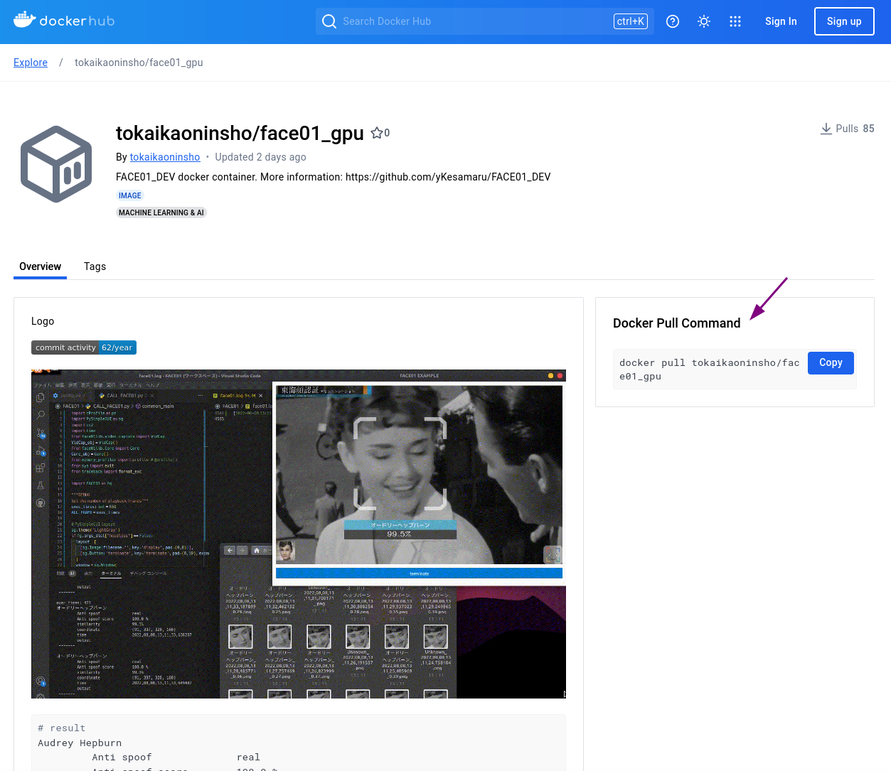

# FACE01ライブラリのステップバイステップガイド
**FACE01の世界へようこそ！**

<br />
<div style="display: flex; align-items: center;">
    
    <div style="background-color: white; padding: 10px; border-radius: 10px; box-shadow: 2px 2px 5px rgba(0, 0, 0, 0.2); position: relative;">
        <p style="margin: 10;">この記事では、エグザンプルプログラムを使用して、`FACE01`を用いた顔認識アプリケーションを作成するために必要な知識と技術を紹介します。</p>
        <p style="margin: 10;">準備はいいですか？</p>
        <div style="position: absolute; top: 50%; left: -15px; width: 0; height: 0; border-top: 10px solid transparent; border-bottom: 10px solid transparent; border-right: 15px solid white; transform: translateY(-50%);"></div>
    </div>
</div>
<br />

まずは、**チェック項目を確認**しましょう。


## ライセンス
- ライセンスについては[こちら](https://github.com/yKesamaru/FACE01_DEV/blob/master/LICENSE/LICENSE)をご覧ください。
- また、YouTube上で`OpenSeeFace`などを動作させるためのライセンスは[こちら](https://github.com/yKesamaru/FACE01_DEV/blob/master/LICENSE/YouTube_license.md)をご覧ください。
- 教育目的で`FACE01`をご利用の場合は[こちら](https://github.com/yKesamaru/FACE01_DEV/blob/master/LICENSE/academic.md)をご覧ください。
- ライセンスに関してご質問がある場合は[Issue](https://github.com/yKesamaru/FACE01_DEV/issues)に投稿するか[メール](mailto:y.kesamaru@tokai-kaoninsho.com)で連絡してください。

## チェック項目
✅
- [x] Pythonの基本操作
- [x] Dockerの基本操作
- [x] Linuxターミナルの基本操作
- [x] (Nvidia GPUを使用する場合) CUDAドライバがすでにインストールされていること

すべての項目を確認しましたか？
OK！では始めましょう！

## [Dockerの使用]
''⭐️''`FACE01`を使用する際、一番簡単な環境構築方法は`Docker`を用いることです。

<br />
<div style="display: flex; align-items: center; justify-content: flex-end;">
    <div style="background-color: white; padding: 10px; border-radius: 10px; box-shadow: 2px 2px 5px rgba(0, 0, 0, 0.2); position: relative; margin-right: 10px;">
        <p style="margin: 10;"><span style="background-color: yellow;">こちらで用意した`Dockerイメージ`を使う</span>ことで、煩わしい環境設定から解放されるだけでなく、予期せぬエラーやローカル環境の汚染を防ぐことが出来ます。</p>
        <p style="margin: 10;"></p>
        <div style="position: absolute; top: 50%; right: -15px; width: 0; height: 0; border-top: 10px solid transparent; border-bottom: 10px solid transparent; border-left: 15px solid white; transform: translateY(-50%);"></div>
    </div>
    
</div>
<br />

[Dockerhub/東海顔認証](https://hub.docker.com/r/tokaikaoninsho/face01_gpu)



`dockerhub`から最新のイメージをプルしましょう。

```bash
docker pull tokaikaoninsho/face01_gpu
```

- `Docker`自体をインストールする方法は[こちら](Install_docker.md)をご覧ください。
- また具体的な`Docker image`の使用法について[こちら](docker.md)で解説しています。
- ご自身でビルドしたい方は[こちら](build_docker_image.md)をご覧ください。

## [FACE01のインストール](Installation.md)
まっさらなシステムに`FACE01`を直接インストールしたい方は[こちら](Installation.md)をご覧ください。

<br />
<div style="display: flex; align-items: center;">
    
    <div style="background-color: white; padding: 10px; border-radius: 10px; box-shadow: 2px 2px 5px rgba(0, 0, 0, 0.2); position: relative;">
        <p style="margin: 10;"><span style="background-color: yellow;">本稼働用のテスト</span>としてFACE01をインストールする場合、ですね⭐️''</p>
        <div style="position: absolute; top: 50%; left: -15px; width: 0; height: 0; border-top: 10px solid transparent; border-bottom: 10px solid transparent; border-right: 15px solid white; transform: translateY(-50%);"></div>
    </div>
</div>
<br />

## [顔画像の登録](register_faces.md)
この記事では、顔画像の登録方法について説明します。
詳細は[こちら](register_faces.md)をご覧ください。

## 仮想Python環境の有効化
Python標準ライブラリの`venv`を使用して仮想環境を開始します。

```bash
# 仮想環境の有効化
. bin/activate
```

## vimのインストール確認
Dockerイメージにはvimがインストールされているので、`conf.ini`を編集できます。

```bash
# vimのインストール確認
which vim
```

## [設定ファイルの編集](config_ini.md)
設定は`config.ini`ファイルで行います。
`config.ini`ファイルについては[こちら](config_ini.md)をご覧ください。

<br />
<div style="display: flex; align-items: center;">
    
    <div style="background-color: white; padding: 10px; border-radius: 10px; box-shadow: 2px 2px 5px rgba(0, 0, 0, 0.2); position: relative;">
        <p style="margin: 10;">設定ファイルの把握は<span style="background-color: yellow;">超重要</span>です！！</p>
        <p style="margin: 10;">かならず確認してくださいね⭐️''</p>
        <div style="position: absolute; top: 50%; left: -15px; width: 0; height: 0; border-top: 10px solid transparent; border-bottom: 10px solid transparent; border-right: 15px solid white; transform: translateY(-50%);"></div>
    </div>
</div>
<br />

## [FACE01の簡単な使用フロー](simple_flow.md)
FACE01の使い方の一例ですが、簡単なフローを見てみましょう。
詳細は[こちら](simple_flow.md)をご覧ください。

## [ファンクションについて](functions.md)
`FACE01`を試用する上での基本的なファンクションについて[こちら](functions.md)で確認しましょう。

## [簡単な顔認識](simple.md)
`simple.py`を試してみましょう。
simple.pyはCUI動作のためのエグザンプルのスクリプトです。

```python
python example/simple.py
```
詳細は[こちら](simple.md)をご覧ください。

## [GUIウィンドウの表示](display_GUI_win.md)
かっこいいGUIウィンドウに表示したいですか？
`example/display_GUI_window.py`を試してみてください。
詳細は[こちら](display_GUI_win.md)をご覧ください。

```python
python example/display_GUI_window.py
```
詳細は[こちら](simple.md)をご覧ください。

## [会社の「テロップ」や「ロゴ」画像を表示](ch_telop.md)
ウィンドウに会社のロゴなどを表示したいですか？
もちろん可能です！
詳細は[こちら](ch_telop.md)をご覧ください。

## [ベンチマークを取りたい？](benchmark_CUI.md)
詳細は[こちら](benchmark_CUI.md)をご覧ください。

## エグザンプルリスト
```python
# 1. Simple
python example/simple.py

# 2. Display GUI window
python example/display_GUI_window.py

# 3. logging
python example/example_logging.py

# 4. data structure
python example/data_structure.py

# 5. Benchmark with CUI mode
python example/benchmark_CUI.py

# 6. Benchmark with GUI mode
python example/benchmark_GUI_window.py

# Other
- example/aligned_crop_face.py
- example/anti_spoof.py
- example/distort_barrel.py
- example/draw_datas.py
- example/face_coordinates.py
- example/get_encoded_data.py
- example/lightweight_GUI.py
...and others.
```

**FACE01の多くのクラスとメソッドの詳細については、[FACE01ドキュメント](https://ykesamaru.github.io/FACE01_DEV/)をご覧ください。**

## トラブルシューティング


<br />
<div style="display: flex; align-items: center;">
    
    <div style="background-color: white; padding: 10px; border-radius: 10px; box-shadow: 2px 2px 5px rgba(0, 0, 0, 0.2); position: relative;">
        <p style="margin: 10;">開発にトラブルはつきもの！😥</p>
        <p style="margin: 10;">発生しやすいトラブル例をまとめました。</p>
        <div style="position: absolute; top: 50%; left: -15px; width: 0; height: 0; border-top: 10px solid transparent; border-bottom: 10px solid transparent; border-right: 15px solid white; transform: translateY(-50%);"></div>
    </div>
</div>
<br />


### CUDAが動作しない
[CUDAライブラリをすべて削除して再インストールする方法](reinstall_gpu.md)をご覧ください。

### `Nvidia jetson`にて`dlib`が動作しない
- `Nvidia Jetson`を使用される場合、ソースコードに手を加えて`dlib`をインストールさせる必要があります（バージョンによります）。
  - `dlib/cuda/cudnn_dlibapi.cpp`854行目`forward_algo = forward_best_algo;`をコメントアウトしてコンパイルして下さい。
    - 参考: [Jetson NanoでDlibをビルドして顔認識でGPUを使ってみる ](https://wisteriahill.sakura.ne.jp/CMS/WordPress/2020/12/15/jetson-nano-build-dlib-use-gpu-for-face-recognition/)

### dlib.DLIB_USE_CUDAがFalseの場合の対処法
[dlib.DLIB_USE_CUDAがFalseの場合の対処法](dlib.DLIB_USE_CUDA.md)をご覧ください。

### `libcudart.so.11.0`などが見つからないエラーが出力される
#### `nvidia-cuda-toolkit`をインストールする
`libcudart.so.11.0`は`CUDA`ランタイムライブラリです。まず`CUDA`がシステムに正しくインストールサれているか確認してください。
```bash
sudo apt update
sudo apt install -y nvidia-cuda-toolkit
```
#### `ONNX Runtime`と`CUDA`のバージョンの互換性を確認する
`ONNX Runtime`と`CUDA`のバージョンの互換性は以下のサイトから確認できます。
[CUDA Execution Provider: Requirements ](https://onnxruntime.ai/docs/execution-providers/CUDA-ExecutionProvider.html#requirements)


#### `シンボリックリンク`の作成
`libonnxruntime_providers_cuda.so`などが必要とする（依存する）ライブラリがすべて正しい場所に存在することを確認します。
```bash
ldd /home/user/bin/FACE01/lib/python3.10/site-packages/onnxruntime/capi/libonnxruntime_providers_cuda.so
```
上記の出力結果から、たとえば以下のようにシンボリックリンクを作成します。
```bash
# libcufft.so.10 のシンボリックリンク作成
sudo ln -s /usr/lib/x86_64-linux-gnu/libcufft.so.10 /usr/local/cuda-11.8/lib64/libcufft.so.10

# libcublas.so.11 のシンボリックリンク作成
sudo ln -s /usr/lib/x86_64-linux-gnu/libcublas.so.11 /usr/local/cuda-11.8/lib64/libcublas.so.11

# libcublasLt.so.11 のシンボリックリンク作成
sudo ln -s /usr/lib/x86_64-linux-gnu/libcublasLt.so.11 /usr/local/cuda-11.8/lib64/libcublasLt.so.11
```
#### `環境変数`に正しいパスを記述して永続化させる
`CUDA`ライブラリが正しいパスに設定されているか確認します。
`~/.bashrc`に以下の記述を行います。
```bash
export PATH=/usr/local/cuda-11.8/bin:$PATH
export LD_LIBRARY_PATH=/usr/local/cuda-11.8/lib64:$LD_LIBRARY_PATH
export CUDA_HOME=/usr/local/cuda-11.8
```
`.bashrc`を再読込してください。
```bash
source ~/.bashrc
```
#### `ONNX Runtime`を再インストール
```bash
pip uninstall onnxruntime-gpu
pip install onnxruntime-gpu==1.18.1
```
以上で必要な`CUDAライブラリ`が正しくロードされるはずです。

> ![HINT]
> `Docker`を利用すると簡単に環境構築ができます。
