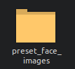
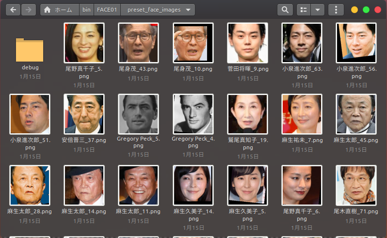

# 顔画像の登録

この記事では、顔画像の登録方法について説明します。

## 登録する顔画像ファイル名のきまり
- ファイル形式は`PNG`にしてください
- 同じ人物の顔画像を複数登録できます。その場合、少なくとも1つのファイルは`<人物名>_default.png`としてください。その他の顔画像ファイルは`<人物名>_1.png`, `<人物名>_2.png`としてください。
  - 例：
  - 
  - ウィンドウに顔画像を描画する際、`default画像`が使用されます。逆に`default画像`が存在しない場合、エラーが発生します。


## 顔画像に関する基本的な知識
パスポート写真と同様に、登録する顔画像が正確であることが重要です。

> 
> 引用元: [Russia Visa Center](https://visa.d2.r-cms.jp/)

FACE01で使用する際は、*高さ200px、幅200px*にしてください。

写真から顔の部分だけを切り取る場合、FACE01の`Utils`クラスにある`align_and_resize_maintain_aspect_ratio`メソッドを使用すると非常に簡単です。
```bash
python example/aligned_crop_face.py docs/img/Elon_Musk_Colorado_2022.jpg
```
- 元の画像
  - [U.S. Air Force photo by Trevor Cokley](https://commons.wikimedia.org/wiki/File:Elon_Musk_Colorado_2022.jpg)

  

- 出力された顔画像
  

ディレクトリ名を引数として指定すると、そのディレクトリ内のすべての画像ファイルが対象となります。

## `preset_images`フォルダに顔画像を配置します。



アプリケーションを起動すると、顔画像が自動的に`128D`の`ndarray`データに変換されます。

ℹ️ **注意**
`preset_images`フォルダ内の他の顔画像ファイルを削除したい場合は、アプリケーションを起動する前にそれらを`debug`フォルダに移動してください。



これで完了です！
とても簡単ですね！
